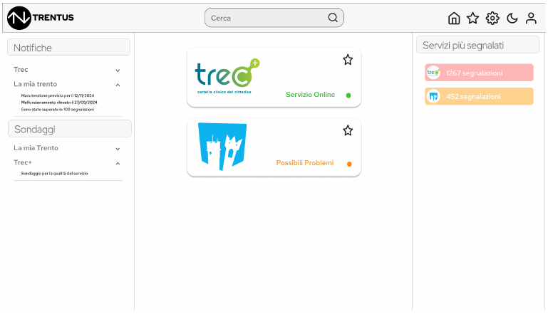

# Trentus - Backend

Trentus è una piattaforma web pensata per centralizzare e semplificare la segnalazione di problemi nei servizi online, facilitando la comunicazione tra utenti e gestori.  
Questa repository contiene **il backend** dell'applicazione.  
Il codice è sviluppato con **Node.js** ed **Express**, utilizzando **MongoDB** come database.  
È incluso anche lo **Swagger** per la documentazione delle API e un pacchetto **Insomnia** per testarle.

---

## 📌 Descrizione del Progetto

Il backend di Trentus gestisce l’intera logica applicativa e le API necessarie per il funzionamento della piattaforma. Supporta:

- Registrazione e autenticazione di utenti, Gestori di Servizi (GdS) e SuperAdmin
- Creazione, modifica e monitoraggio dei servizi online
- Invio e gestione di **avvisi** e **sondaggi** da parte dei GdS
- Invio e gestione di **segnalazioni** e **feedback** da parte degli utenti
- Controllo degli accessi basato sui ruoli: `Utente`, `GdS`, `SuperAdmin`

